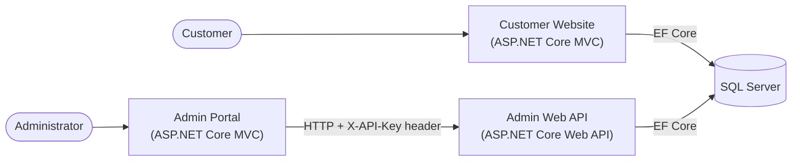

# MCBA Banking System

An internet banking system built with ASP.NET Core 9: a customer banking website, a REST API for administrators, and an admin portal that consumes it.

## Architecture



| Project | Description | Default URL |
|---|---|---|
| `MCBA` | **Customer Website.** Customers log in to view accounts, deposit, withdraw, transfer, view paged statements, schedule bill payments and edit their profile. A hosted background service runs scheduled bill payments every minute. Owns the EF Core migrations and seeds the database on first run. | http://localhost:5152 |
| `MCBA_AdminWebApi` | **Admin Web API.** REST endpoints for managing payees and blocking or unblocking scheduled bill payments. Uses the same database through its own EF Core context and the repository pattern. | http://localhost:5081 |
| `MCBA_AdminPortal` | **Admin Portal.** An MVC front end for administrators. Has no database access and does everything through the Admin Web API. | http://localhost:5062 |
| `MCBA_Tests` | xUnit tests for all three projects, using Moq and the EF Core InMemory provider. | n/a |

The customer website and the Admin Web API share one SQL Server database. The Admin Portal only talks to the API.

## Tech stack

- **.NET 9** / ASP.NET Core MVC and Web API
- **Entity Framework Core 9** with **SQL Server**, code-first migrations
- **Authentication:**
  - Customer website: session-based login, with passwords verified against PBKDF2 hashes ([SimpleHashing.Net](https://www.nuget.org/packages/SimpleHashing.Net))
  - Admin Web API: `POST /api/Authorization/login` issues a token that must be sent in the `X-API-Key` header on later requests
  - Admin Portal: logs in through the API and attaches the token to each request
- **UI:** Razor views, Bootstrap, X.PagedList for paging
- **Testing:** xUnit, Moq, EF Core InMemory

## Getting started

### Prerequisites

- [.NET 9 SDK](https://dotnet.microsoft.com/download/dotnet/9.0)
- A SQL Server instance. The quickest option is Docker:

  ```bash
  docker run -e "ACCEPT_EULA=Y" -e "MSSQL_SA_PASSWORD=<YourStrong!Passw0rd>" \
    -p 1433:1433 -d mcr.microsoft.com/mssql/server:2022-latest
  ```
- The EF Core CLI: `dotnet tool install --global dotnet-ef`

### 1. Configure secrets

Secrets aren't committed. Each project's `appsettings.example.json` shows the expected shape. For local development, store your values with [.NET User Secrets](https://learn.microsoft.com/aspnet/core/security/app-secrets):

```bash
CONN="Server=localhost,1433;Database=MCBA;User Id=sa;Password=<YourStrong!Passw0rd>;TrustServerCertificate=True"

# Customer website
dotnet user-secrets set "ConnectionStrings:MCBAContext" "$CONN" --project MCBA

# Admin Web API
dotnet user-secrets set "ConnectionStrings:MCBAContext" "$CONN" --project MCBA_AdminWebApi
dotnet user-secrets set "AdminCredentials:Username" "admin" --project MCBA_AdminWebApi
dotnet user-secrets set "AdminCredentials:Password" "<choose-a-password>" --project MCBA_AdminWebApi
```

In other environments, use environment variables instead, for example `ConnectionStrings__MCBAContext` and `AdminCredentials__Password`.

### 2. Create the database

```bash
dotnet ef database update --project MCBA
```

On first start, the customer website seeds sample payees and loads customer, account and transaction data from the JSON web service set in `ConnectionStrings:CustomerWebService`.

### 3. Build and run

```bash
dotnet build MCBA.sln

# Run each in its own terminal
dotnet run --project MCBA               # Customer website  -> http://localhost:5152
dotnet run --project MCBA_AdminWebApi   # Admin Web API     -> http://localhost:5081
dotnet run --project MCBA_AdminPortal   # Admin portal      -> http://localhost:5062
```

The Admin Portal reads the API's base URL from `ConnectionStrings:AdminApiUrl` in its `appsettings.json` (default `http://localhost:5081/api`).

### 4. Run the tests

```bash
dotnet test MCBA.sln
```

## Admin Web API reference

All endpoints except login and logout require the `X-API-Key` header.

| Method | Route | Description |
|---|---|---|
| `POST` | `/api/Authorization/login` | Body `{ "username": "...", "password": "..." }`. Returns a token. |
| `POST` | `/api/Authorization/logout` | Body: the token as a JSON string. Revokes the token. |
| `GET` | `/api/BillPay` | List all scheduled bill payments |
| `GET` | `/api/BillPay/{id}` | Get one bill payment |
| `POST` | `/api/BillPay/block/{id}` | Block a scheduled payment |
| `POST` | `/api/BillPay/unblock/{id}` | Unblock a payment |
| `GET` | `/api/Payee` | List all payees |
| `GET` | `/api/Payee/{id}` | Get one payee |
| `GET` | `/api/Payee/postcode/{postcode}` | Filter payees by postcode |
| `PUT` | `/api/Payee/{id}` | Update a payee |
